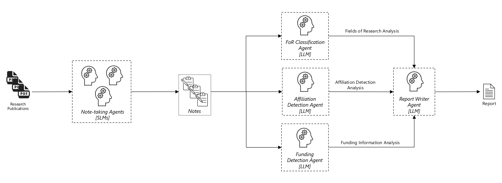

# Multi-Agent Pattern for Research Publication Analysis  

## Overview  



This pattern is designed to facilitate the analysis of research papers using the powerful capabilities of Azure OpenAI. 
The primary objective of this pattern is to automate the extraction and categorization of key insights from research papers written in markdown format. 
By leveraging Azure OpenAI's advanced natural language processing abilities, the script can:
  
- Parse PDF documents into markdown format
- Extract key insights and bullet points from the markdown.  
- Categorize the extracted information according to different research fields, funding sources, and affiliations.
- Generate a summary of the paper's content and structure.  
- Format and save the results into a 1-page Markdown report (documenting notes + analysis along the way).
- Collate and save the summarised results into a single Markdown table for easy review across papers.
  
This pattern aims to save researchers significant time and effort by automating the tedious process of reading and summarizing lengthy research papers, allowing them to focus more on the critical aspects of their work.  

## Getting Started

To prepare your environment for running this codebase, follow the steps outlined in the [Setup](./SETUP.md).

## Run the Analyser

To run the analyser, simply execute the `run.sh` or `run.ps1` script.

There are a number of command line arguments that you can pass to control the behaviour of the script.

If in doubt, simply run the script with the `--help` argument, and it will display a short help message that includes a brief explanation of each argument.

Here's a brief overview of the configuration options: 

| Command Argument         | Environment Variable       | Default            | Description                                                                                         | 
|--------------------------|----------------------------|--------------------|-----------------------------------------------------------------------------------------------------|
| `--openai-key`           | `AZURE_OPENAI_API_KEY`     | <not specified>    | The API Key to use for the Azure OpenAI API                                                         |
| `--openai-endpoint`      | `AZURE_OPENAI_ENDPOINT`    | <not specified>    | RL of the API Endpoint to use for the Azure OpenAI API                                              |
| `--openai-api-version`   | `AZURE_OPENAI_API_VERSION` | 2024-02-15-preview | Specifies the API Version to use                                                                    |
| `--notetaking-model`     | `NOTETAKING_MODEL`         | gpt-4o-mini        | The name of the model deployment to use for the "Notetaking" portion of the workflow                | 
| `--interpretation-model` | `INTERPRETATION_MODEL`     | gpt-4o             | The name of the model deployment to use for the interpretation and analysis portion of the workflow |
| `--local-university`     | `LOCAL_UNIVERSITY`         | <not specified>    | The name of the local university (used when associatiing affiliations to the local university)      | 
| `--filter`               | `FILTER`                   | <not specified>    | A regex to limit the set of files that will be processed                                            | 
| `--source-dir`           | `SOURCE_DIR`               | source             | The path to the directory where the source PDF files are to be found                                | 
| `--interim-dir`          | `INTERIM_DIR`              | interim            | The path to the directory where the interim files (eg. notes) will be written                       |
| `--output-dir`           | `OUTPUT_DIR`               | output             | The path to the directory where the report files will be written                                    | 
| `--force-update`         | `FORCE_UPDATE`             | false              | When specified, all files in the source will be re-processed from scratch                           | 
| `--max-files`            | `MAX_FILES`                | 0                  | Limits the number of files to be processed (useful for debugging) [0 == No limit]                   | 
| `--concurrency`          | `CONCURRENCY`              | 4                  | The number of files to process in parallel                                                          | 
| `--workers`              | `WORKERS`                  | 8                  | Number of workers to allocate to performing tasks within the file processed                         | 
| `--temperature`          | `TEMPERATURE`              | 0.1                | A value between 0 and 1 to control the creativity of the AI models                                  | 


### Filtering

The `--filter` command line argument allows you to control which files should be processed.

The value of the `--filter` argument is expected to be a valid Regular Expression.

Any source file name that matches the Regular Expression at *any* point within the filename will be processed.

For example, if you run the app with the following argument: `--filter="(1234|abcdef|1a2b3c)"` 
Assuming the following files in the source directory, the following will occur: 

| File         | Will Process |
|--------------|--------------|
| abc-123.pdf  | NO           | 
| abc-1234.pdf | YES          | 
| 1234-abc.pdf | YES          |
| abcd.pdf     | NO           | 
| ttt.pdf      | NO           | 
| 1a2b3c4d.pdf | YES          | 
| tt1a2b3c.pdf | YES          | 


Any valid regular expression (supported by the Python RE parser) is acceptable.

### Local University

It's important to set the local university either using the command line argument `--local-university` or as an environment variable `LOCAL_UNIVERSITY`.

eg. `./run.sh --local-university="Awesome University"` 

or, in the `.env` file: 

```INI
LOCAL_UNIVERSITY=Awesome University
```

This will allow the processor to explicitly look for and associate affiliations with the specified local university.
